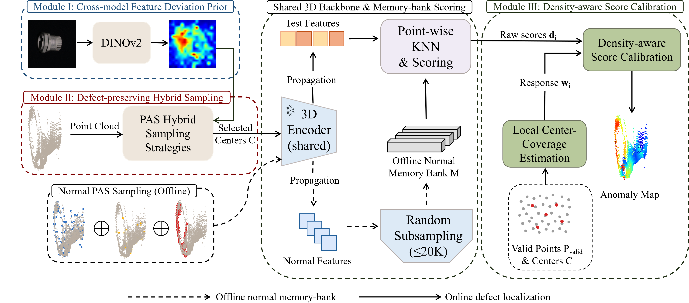

# PAS

**Prior-guided Adaptive Sampling for 3D Industrial Anomaly Detection**

Official implementation of **PAS**, a prior-guided adaptive sampling method for 3D industrial anomaly detection.

PAS is designed as a **sampling-stage module** rather than a standalone anomaly detection pipeline. It derives a 2D anomaly prior from cross-model feature deviation and uses it to adaptively redistribute sampling centers toward potentially anomalous regions while preserving geometric coverage. The resulting sampling information is further incorporated into 3D anomaly scoring through Density-aware score calibration.

---

## Framework

<p align="center">
  
</p>

<p align="center">
  <b>Overview of the proposed PAS framework.</b>
</p>

PAS mainly consists of three modules:

1. **Cross-model feature deviation prior**  
   PAS extracts a 2D anomaly prior from cross-model feature deviation and
   projects the resulting anomaly evidence from the image domain to the
   corresponding 3D points.

2. **Defect-preserving hybrid sampling**  
   The projected prior guides the allocation of sampling centers toward
   potentially anomalous regions, while geometric exploration is retained
   to preserve global point-cloud coverage and avoid excessive sampling
   concentration.

3. **Density-aware score calibration**  
   Local center coverage is estimated after sampling and incorporated into
   point-level anomaly scoring, compensating for the non-uniform center
   distribution introduced by prior-guided sampling.

---

## Highlights

- **Sampling-stage design** — PAS can be integrated into an existing 3D anomaly detection pipeline without replacing the complete detector.
- **Prior-guided center allocation** — 2D anomaly evidence is used to redistribute the limited sampling budget toward potentially abnormal regions.
- **Geometry preservation** — anomaly-guided sampling is combined with geometric exploration to avoid excessive concentration of centers.
- **Density-aware score calibration** — sampling information is explicitly introduced into the subsequent 3D anomaly scoring stage.
- **Multiple datasets** — experiments are provided for MVTec 3D-AD, Eyecandies, and Real-IAD D3.
- **Extensive analysis** — the repository contains scripts for sampling comparisons, component ablation, cross-backbone evaluation, budget analysis, defect-size analysis, sensitivity studies, and efficiency evaluation.

---

## Codebase

PAS is implemented on top of the **M3DM** framework for multimodal 3D industrial anomaly detection.

The repository can be conceptually divided into three parts.

### 1. M3DM-based pipeline

The base multimodal anomaly detection pipeline is mainly contained in:

```text
main.py
m3dm_runner.py
dataset.py
feature_extractors/
models/
utils/
```

These modules provide the underlying RGB/3D feature extraction, memory-bank construction, anomaly scoring, and evaluation pipeline required by PAS.

### 2. PAS implementation

The main PAS-related implementation is contained in:

```text
utils/pas_core.py
backbones/pas_sampler.py
utils/sampling_metrics.py
utils/local_recall.py
```

Additional sampling strategies and backbone interfaces are provided under:

```text
backbones/
```

Some base modules are also modified to integrate PAS into the complete anomaly detection pipeline.

### 3. Paper reproduction scripts

Scripts prefixed with `benchmark_` are used for the experiments and analyses reported in the paper.

---

## Repository Structure

```text
PAS/
├── backbones/
│   ├── pas_sampler.py              # PAS sampling implementation
│   ├── random_sampler.py           # Random sampling
│   ├── density_fps.py              # Density-aware FPS
│   ├── curvature_sampler.py        # Curvature-based sampling
│   ├── gss_sampler.py              # Additional sampling baseline
│   ├── voxel_sampler.py            # Voxel-based sampling
│   ├── pointnet2_backbone.py
│   ├── pointnet2_seg.py
│   ├── dgcnn_seg.py
│   ├── pct_seg.py
│   └── ...
│
├── feature_extractors/
│   ├── features.py
│   └── multiple_features.py
│
├── models/
│   ├── models.py
│   ├── feature_fusion.py
│   └── pointnet2_utils.py
│
├── utils/
│   ├── pas_core.py                 # Core PAS utilities
│   ├── sampling_metrics.py         # Sampling-related metrics
│   ├── local_recall.py
│   ├── result_logger.py
│   ├── mvtec3d_util.py
│   ├── preprocessing.py
│   └── ...
│
├── figures/
│   └── pas_framework.png
│
├── main.py                         # M3DM-based main entry
├── m3dm_runner.py                  # Main anomaly detection pipeline
├── dataset.py                      # Dataset loaders
├── pointnet2_ops_shim.py
│
├── benchmark_pas_full.py           # Main PAS pipeline
├── benchmark_pas_pointnet2.py      # PointNet++ experiments
├── benchmark_pas_eyecandies.py     # Eyecandies experiments
├── benchmark_pas_realiad_v2.py     # Real-IAD D3 experiments
├── benchmark_pas_sampling_methods.py
├── benchmark_component_ablation.py
├── benchmark_pas_budget.py
├── benchmark_cross_backbone.py
├── benchmark_surface_coverage.py
├── benchmark_defect_size.py
├── benchmark_three_seed.py
├── benchmark_efficiency_e2e.py
├── benchmark_hyperparameter_sweep.py
├── benchmark_kin_sensitivity_fixed.py
├── benchmark_btf_fpfh.py
├── aggregate_multiseed_pn2.py
│
├── requirements.txt
├── LICENSE
├── THIRD_PARTY.md
└── README.md
```

---

## Environment

The complete PAS experimental pipeline is intended to run on Linux with an
NVIDIA GPU and CUDA.

A typical environment includes:

```text
Python 3.10
PyTorch
CUDA
```

Install the basic dependencies with:

```bash
pip install -r requirements.txt
```

### CUDA Dependencies

Some components inherited from the M3DM/Point-MAE pipeline depend on
CUDA-based operators, including:

```text
knn_cuda
pointnet2_ops
```

Therefore, a CUDA-enabled PyTorch environment is required for running the
complete experimental pipeline.

A CPU-only environment can still be used for code inspection, repository
management, and static analysis, but the complete PAS pipeline is not expected
to execute without CUDA.

PointNet++ experiments may additionally require the corresponding compiled
PointNet++ CUDA operators.

---

## Dataset Preparation

Experiments in this repository use three public industrial anomaly detection datasets:

- **MVTec 3D-AD**
- **Eyecandies**
- **Real-IAD D3**

The original datasets are **not redistributed** in this repository. Please obtain them from their respective official sources and comply with their original licenses.

A recommended directory layout is:

```text
datasets/
├── mvtec3d/
│
├── eyecandies_raw/
│   └── eyecandies/
│
├── eyecandies_preprocessed/
│
├── Real-IAD-D3/
│
└── patch_lib/
    └── offline_features/
        └── mvtec3d/
```

Dataset locations can also be changed through the corresponding command-line arguments where supported.

### MVTec 3D-AD

The default path used by most MVTec 3D-AD experiments is:

```text
datasets/mvtec3d
```

### Eyecandies

The repository contains preprocessing utilities for Eyecandies:

```text
utils/preprocess_eyecandies.py
utils/preprocess_eyecandies_fixed.py
```

A typical preprocessing command is:

```bash
python utils/preprocess_eyecandies_fixed.py \
    --dataset_path datasets/eyecandies_raw/eyecandies \
    --target_dir datasets/eyecandies_preprocessed
```

The processed dataset is expected at:

```text
datasets/eyecandies_preprocessed
```

### Real-IAD D3

The default directory used by the Real-IAD D3 benchmark is:

```text
datasets/Real-IAD-D3
```

---

## Pretrained Models

PAS uses pretrained RGB and point-cloud encoders inherited from the
M3DM-based feature extraction pipeline.

The main pretrained checkpoints required by the PAS experiments are:

```text
checkpoints/
├── dinov2_vitb14_pretrain.safetensors
└── pointmae_pretrain.pth
```

### DINOv2

DINOv2 ViT-B/14 is used as the RGB feature extractor.

The implementation looks for:

```text
checkpoints/dinov2_vitb14_pretrain.safetensors
```

and also supports:

```text
checkpoints/dinov2_vitb14_pretrain.pth
```

Please obtain the corresponding pretrained DINOv2 weights from the official
DINOv2 project and place them under `checkpoints/`.

### Point-MAE

Point-MAE is used as the pretrained point-cloud feature extractor.

The expected checkpoint path is:

```text
checkpoints/pointmae_pretrain.pth
```

Please obtain the pretrained Point-MAE weights from the official Point-MAE
project and place them at the path above.

> Pretrained weights are not redistributed in this repository. Please obtain
> them from their respective official sources and follow the corresponding
> licenses.

### Note on the M3DM Base Entry

The inherited `main.py` retains the original M3DM argument:

```text
--fusion_module_path
```

with a legacy default path of:

```text
checkpoints/checkpoint-0.pth
```

This checkpoint is not required by the PAS paper reproduction scripts
provided in this repository. The recommended PAS experiments should be run
through the corresponding `benchmark_*.py` scripts.

---

## Running PAS

### MVTec 3D-AD

The main PAS experiments on MVTec 3D-AD are implemented in:

```bash
python benchmark_pas_full.py
```

The PointNet++ version provides command-line options:

```bash
python benchmark_pas_pointnet2.py \
    --dataset_path datasets/mvtec3d \
    --tau 0.6
```

Use:

```bash
python benchmark_pas_pointnet2.py --help
```

to inspect the available options.

### Eyecandies

Run the Eyecandies benchmark with:

```bash
python benchmark_pas_eyecandies.py \
    --dataset_base datasets \
    --tau 0.6
```

Available options can be inspected with:

```bash
python benchmark_pas_eyecandies.py --help
```

### Real-IAD D3

A typical Real-IAD D3 experiment can be launched with:

```bash
python benchmark_pas_realiad_v2.py \
    --data_root datasets/Real-IAD-D3 \
    --bank_seed 42
```

For experiments using the PointNet++ backbone:

```bash
python benchmark_pas_realiad_v2.py \
    --data_root datasets/Real-IAD-D3 \
    --bank_seed 42 \
    --xyz_backbone PointNet2
```

The complete list of options is available through:

```bash
python benchmark_pas_realiad_v2.py --help
```

---

## Reproducing the Paper Experiments

The repository contains dedicated scripts corresponding to the major analyses in the paper.

| Experiment | Script |
|---|---|
| Main PAS pipeline | `benchmark_pas_full.py` |
| PointNet++ evaluation | `benchmark_pas_pointnet2.py` |
| Eyecandies evaluation | `benchmark_pas_eyecandies.py` |
| Real-IAD D3 evaluation | `benchmark_pas_realiad_v2.py` |
| Component ablation | `benchmark_component_ablation.py` |
| Sampling-method comparison | `benchmark_pas_sampling_methods.py` |
| Sampling-budget analysis | `benchmark_pas_budget.py` |
| Cross-backbone evaluation | `benchmark_cross_backbone.py` |
| Surface-coverage analysis | `benchmark_surface_coverage.py` |
| Defect-size analysis | `benchmark_defect_size.py` |
| Multi-seed evaluation | `benchmark_three_seed.py` |
| Multi-seed aggregation | `aggregate_multiseed_pn2.py` |
| End-to-end efficiency | `benchmark_efficiency_e2e.py` |
| Hyperparameter sensitivity | `benchmark_hyperparameter_sweep.py` |
| Neighborhood sensitivity | `benchmark_kin_sensitivity_fixed.py` |
| FPFH-based comparison | `benchmark_btf_fpfh.py` |

Unless otherwise stated in the corresponding scripts, experiments should be conducted with the same dataset splits, random seeds, sampling budgets, pretrained checkpoints, and evaluation protocol used in the paper.

---

## Evaluation

The repository contains utilities for evaluating anomaly detection and localization performance, including modules related to:

```text
Image-level AUROC
Pixel/point-level AUROC
AUPRO
sampling coverage
local defect retention/recall
```

Relevant utilities include:

```text
utils/au_pro_util.py
utils/sampling_metrics.py
utils/local_recall.py
```

For reproducibility, we recommend keeping the evaluation protocol unchanged when comparing PAS with alternative sampling strategies.

---

## Reproducibility Notes

To obtain comparable results:

1. Use the same pretrained backbone weights.
2. Keep the dataset preprocessing procedure unchanged.
3. Use the same sampling budget for PAS and competing sampling strategies.
4. Fix the corresponding random seeds when performing multi-seed experiments.
5. Use identical downstream anomaly detection and scoring configurations when comparing different sampling methods.
6. Do not use test-set annotations during sampling or model construction.

Large datasets, pretrained checkpoints, generated memory banks, and intermediate experimental outputs are intentionally excluded from this repository.

---

## Results

The quantitative results reported in the paper are produced using the experiment scripts included in this repository.

The final paper tables and consolidated result files will be added together with the publication-ready release.

---

## Acknowledgements

PAS is implemented on top of the **M3DM** codebase. We thank the authors of M3DM for releasing their implementation.

This project also relies on or adapts components associated with pretrained models and point-cloud libraries such as:

- DINOv2
- Point-MAE
- PointNet++
- DGCNN

The M3DM-derived portions of this repository retain their original MIT license and copyright notice.

Please refer to [`THIRD_PARTY.md`](THIRD_PARTY.md) for additional information regarding third-party components.

---

## Citation

Citation information for PAS will be added after publication.

If you use the M3DM-based portions of this repository, please also cite the original M3DM work as appropriate.

---

## License

This repository is distributed under the terms described in [`LICENSE`](LICENSE).

The original M3DM copyright notice is retained in accordance with its MIT license.

Third-party components and pretrained models remain subject to their respective original licenses and terms of use. See [`THIRD_PARTY.md`](THIRD_PARTY.md) for details.
