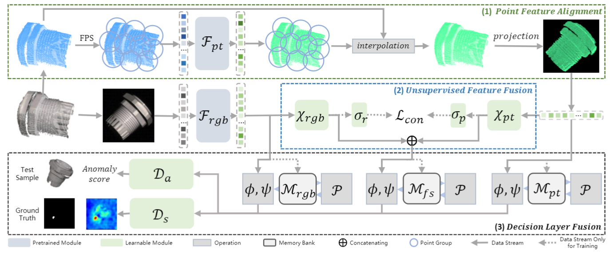

# PAS

Official implementation of **PAS: Prior-guided Adaptive Sampling for 3D Industrial Anomaly Detection**.

PAS is a sampling-stage method for 3D industrial anomaly detection. It leverages a 2D anomaly prior to adaptively redistribute sampling centers toward potentially anomalous regions while retaining geometric coverage, and further introduces coverage-aware calibration for 3D anomaly scoring.

## Framework



## Codebase

PAS is implemented on top of the M3DM framework for multimodal 3D anomaly detection.

This repository mainly consists of three parts:

1. **M3DM-based pipeline**
   - `main.py`
   - `m3dm_runner.py`
   - `feature_extractors/`
   - `models/`
   - base utility modules in `utils/`

2. **PAS implementation**
   - `utils/pas_core.py`
   - `backbones/pas_sampler.py`
   - `utils/sampling_metrics.py`
   - related sampling and coverage-aware calibration modules

3. **Paper reproduction scripts**
   - `benchmark_pas_*.py`
   - component ablation
   - cross-backbone experiments
   - sampling analysis
   - sensitivity and efficiency experiments

## Repository Structure

```text
PAS/
├── backbones/                 # 3D backbones and sampling methods
├── feature_extractors/        # Feature extraction modules
├── models/                    # Model components
├── utils/                     # Base utilities and PAS utilities
├── figures/                   # Figures used in the repository
│
├── main.py                    # M3DM-based main entry
├── m3dm_runner.py             # Main anomaly detection pipeline
├── dataset.py                 # Dataset loaders
│
├── benchmark_pas_full.py
├── benchmark_pas_pointnet2.py
├── benchmark_pas_eyecandies.py
├── benchmark_pas_realiad_v2.py
├── benchmark_component_ablation.py
├── benchmark_pas_sampling_methods.py
├── benchmark_cross_backbone.py
├── benchmark_surface_coverage.py
└── requirements.txt
